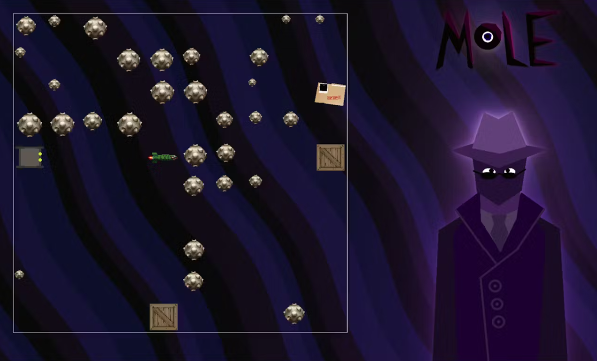
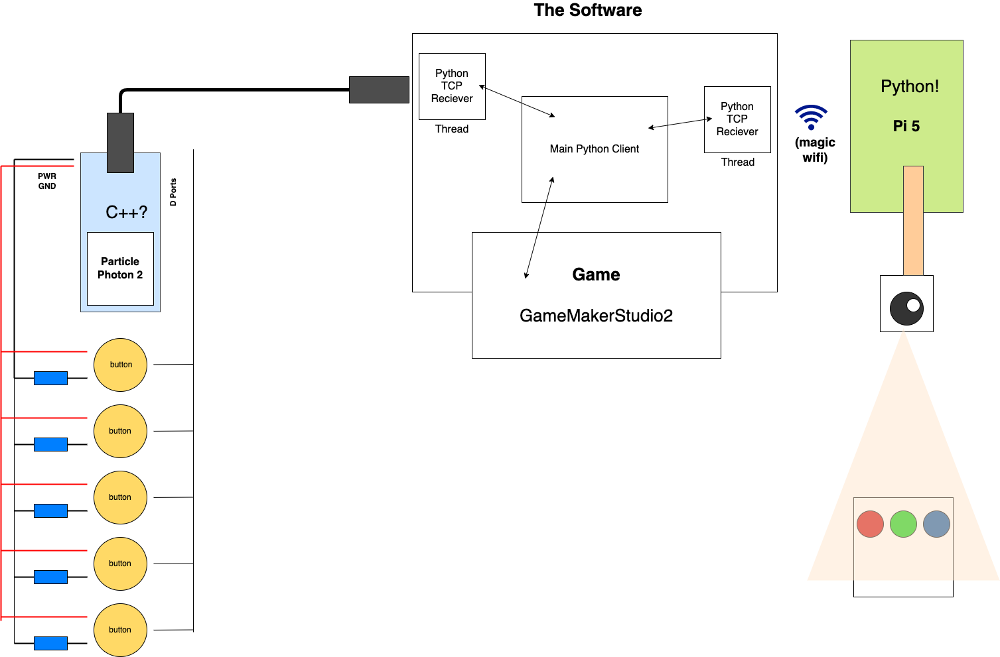

 

  <h3 align="center">Mole</h3>

  

    🕺 1st Place at Hack The Museum! Networked Computer-Vision Punchcard Programming game deployed with GameMaker and Python3.
     
     
    <a href="https://www.hackster.io/tobybenjaminclark/mole-28b94b">View Hackster</a>
    ·
    <a href="https://github.com//aswarbs/mole/issues">Report Bug</a>
    ·
    <a href="https://github.com/aswarbs/mole/issues">Request Feature</a>
  

## About The Project

Mole is a computer vision powered logic game where you program the main character by colouring in paper, inspired by punchcard computers!

We are interested in old computers, and wanted to create a game that embodies a form of physical programming similar to that seen in punchcard computers.

The goal of the game is to program a robot using coloured circles on a piece of paper to destroy a top secret document in a randomly generated level! You can go forward, turn right and shoot missiles to clear your path/destroy the files if you get a clear shot!

So we created Mole! Mole is a game where you program a robot to destroy some secret documents. You do this by drawing colored circles on a piece of paper, which are scanned using a Raspberry Pi Camera (We didn't bring a webcam...) and then are interpreted with computer vision.

From here, the drone in game can fire missiles, go forward or turn left. Similar to the controls for RURPLE. We think this was a pretty neat control mechanism and a prototype like this could form the basis for teaching children how old computers work in an accessible and innovative way.

We used the Particle Photon 2 to handle button presses, and then forwarded this to the Pi to capture the image. All communication was done over either raw TCP sockets or just serial communication over USB.

## Getting Started

Here are some instructions on prerequisites to run the project, and how to use the game.

### Prerequisites

There are multiple hardware components in this project:

<ul>
  <li><strong>Raspberry Pi 5</strong>: We used the Pi Camera 2 for the Pi 5 to act as a webcam.</li>
  <li><strong>Particle Photon 2</strong>: We hooked up five buttons to a breadboard connected to the Particle device. The pinout for this is below.</li>
</ul>

The game was created in Gamemaker, with the server running Python 3.8.10.

The game also uses paper and pens as input; we used red, green, and blue Sharpies.

### Installation

1. Clone this repo.
3. Install the Python requirements: `pip install -r requirements.txt`
4. Ensure that the Particle device is connected via USB serial connection.
5. Replace the port in `buttons.py` with the name of the Particle connected port. On Windows, this can be found in Device Manager.
6. Run `controller.py`. Replace the IP with the IP of your device, and the port with your desired port.
7. Run `piclient.py` on a Raspberry Pi on the same network.
8. Run the Gamemaker Project, changing the IP and port as desired.

## Usage

The controls of the game are quite basic:
<ul>
  <li><strong>Buttons</strong>: Press the button to take a photo!</li>
  <li><strong>Drawings</strong>: Colour a sequence of shapes to control the player. Red is forward, Green is turn, and Blue is shoot!</li>
</ul>

## Contributors

The GameMaker frontend and Particle button logic was created by Toby Clark, with the networking, computer vision, and Raspberry Pi transmission handled by Amber Swarbrick.

## License

The project is distributed under the MIT license. See `LICENSE.md` for more information.

